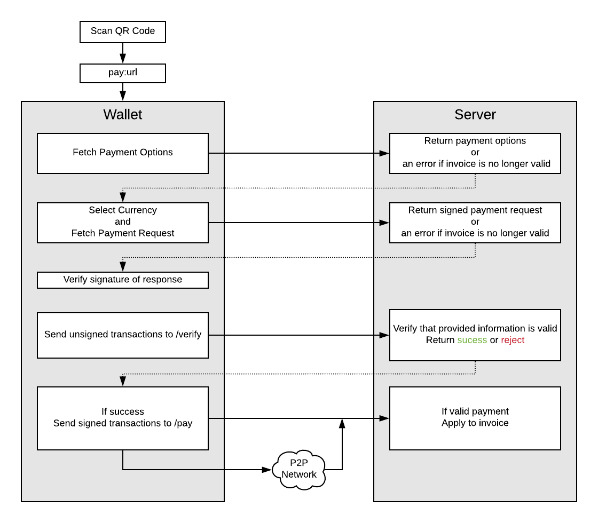

# JSON Payment Protocol Specification v2

Revision 0.1

## Application Logic

1. (Client) Wallet obtains payment protocol uri
2. (Client) Selects a currency from the list of payment-options
3. (Client) Fetches payment information from server
4. (Server) Verifies invoice exists and is still accepting payments, responds with payment-request
5. (Client) Validates payment request hash
6. (Client) Validates payment request signature
8. (Client) Generates a payment to match instructions on payment-request
9. (Client) Submits proposed unsigned transaction (and size of signed transaction for BTC/BCH) to server
10. (Server) Validates invoice exists and is still accepting payments
11. (Server) Validates payment matches address, amount, and currency of invoice and has a reasonable transaction fee.
12. (Server) Notifies client payment will be accepted
13. (Client) Sends payment to server and broadcasts to p2p network
14. (Server) Validates signed payment and broadcasts payment to network.

In general, the payment should not be broadcast by the client. If at time of verification the payment is rejected by the server **your client must not broadcast the payment**.
Broadcasting a payment before getting a success notification back from the server will in most cases lead to a failed payment for the sender. The sender will bear the cost of paying transaction fees yet again to get their money back.



## Payment Options

### Request
A GET request should be made to payment protcol url. 
Example: 
 * /i/someinvoiceid

#### Headers
* `Accept` = `application/payment-options`.
* `x-paypro-version` = 2


### Response
A list of payment options will be returned.

```
{
    "time": "2019-06-13T18:07:33.495Z",
    "expires": "2019-06-13T18:22:33.495Z",
    "memo": "Payment request for BitPay invoice R4GvGy1ZbZhLWxcHq4u2hm for merchant Micah's Cool Store",
    "paymentUrl": "https://mriggan.bp:8088/i/R4GvGy1ZbZhLWxcHq4u2hm",
    "paymentId": "R4GvGy1ZbZhLWxcHq4u2hm",
    "paymentOptions": [
        {
            "chain": "BTC",
            "currency": "BTC",
            "network": "regtest",
            "estimatedAmount": 15100,
            "decimals": 8
        },
        {
            "chain": "BCH",
            "currency": "BCH",
            "network": "regtest",
            "estimatedAmount": 240800,
            "decimals": 8
        },
        {
            "chain": "ETH",
            "currency": "ETH",
            "network": "regtest",
            "estimatedAmount": 3864000000000000,
            "decimals": 18
        },
        {
            "chain": "ETH",
            "currency": "GUSD",
            "network": "regtest",
            "estimatedAmount": 100,
            "decimals": 2
        },
        {
            "chain": "ETH",
            "currency": "USDC",
            "network": "regtest",
            "estimatedAmount": 1000000,
            "decimals": 6
        },
        {
            "chain": "ETH",
            "currency": "PAX",
            "network": "regtest",
            "estimatedAmount": 1000000000000000000,
            "decimals": 18
        }
    ]
}
```
#### Body
* `time` - ISO Date format of when the invoice was generated
* `expires` - ISO Date format of when the invoice will expire
* `memo` - A plain text description of the payment request, can be displayed to the user / kept for records
* `paymentUrl` - The url where the payment should be sent
* `paymentId` - The invoice ID, can be kept for records
* `paymentOptions` - An array of payment options. Each option includes the chain and currency

#### Payment Options
Each payment option includes
* `chain` - The chain that the transaction should be valid on
* `currency` - The currency on a given chain that the trasaction should be denominated in
* `network` - The network that the transaction should be valid on
* `estimatedAmount` - Amount of currency units required to pay this invoice
* `decimals` - Number of decimal places the currency uses

## Payment Request

### Request
A POST request should be made to the payment protocol url with a JSON dictionary containing `{chain, currency}` fields

#### Examples: 

 * /i/someinvoiceid

#### Headers
* `Content-Type` = `application/payment-request`.
* `x-paypro-version` = 2

**Note: Do NOT use the standard `application/json` `Content-Type`**

**Note: Do NOT include an `Accept` property**

#### Request Body
* `chain` = a chain that was present in the payment-options response
* `currency` = Optional, the particular currency on the chain you will pay with. Defaults to chain

```JSON
{
  "chain": "<chain 3 letter code>",
  "currency": "<optional (ERC20) 3 letter code>",
}
```


### Response
#### BTC Response
```
{
    "time": "2019-06-13T18:34:09.010Z",
    "expires": "2019-06-13T18:49:09.010Z",
    "memo": "Payment request for BitPay invoice PfCwZLxWctSrdgYcnJM8G8 for merchant Micah's Cool Store",
    "paymentUrl": "https://mriggan.bp:8088/i/PfCwZLxWctSrdgYcnJM8G8",
    "paymentId": "PfCwZLxWctSrdgYcnJM8G8",
    "chain": "BTC",
    "network": "regtest",
    "instructions": [
        {
            "type": "transaction",
            "requiredFeeRate": 20,
            "outputs": [
                {
                    "amount": 15100,
                    "address": "my6aWcW2r3WiXpnK2MMWHfGgQ1VFmA2LLv"
                }
            ]
        }
    ]
}
```
#### BCH Response
```
{
    "time": "2019-06-13T18:35:19.138Z",
    "expires": "2019-06-13T18:50:19.138Z",
    "memo": "Payment request for BitPay invoice TiXuyEmcJRCcinoFoY3Cym for merchant Micah's Cool Store",
    "paymentUrl": "https://mriggan.bp:8088/i/TiXuyEmcJRCcinoFoY3Cym",
    "paymentId": "TiXuyEmcJRCcinoFoY3Cym",
    "chain": "BCH",
    "network": "regtest",
    "instructions": [
        {
            "type": "transaction",
            "requiredFeeRate": 1,
            "outputs": [
                {
                    "amount": 239200,
                    "address": "n3YaQSkTXrpbQyAns1kQQRxsECMn9ifx5n"
                }
            ]
        }
    ]
}
```

#### ETH Response
```
{
    "time": "2019-06-13T18:33:00.827Z",
    "expires": "2019-06-13T18:48:00.827Z",
    "memo": "Payment request for BitPay invoice S6cxqqUNUcMV41dfBS8XHn for merchant Micah's Cool Store",
    "paymentUrl": "https://mriggan.bp:8088/i/S6cxqqUNUcMV41dfBS8XHn",
    "paymentId": "S6cxqqUNUcMV41dfBS8XHn",
    "chain": "ETH",
    "network": "regtest",
    "instructions": [
        {
            "type": "transaction",
            "value": 3836000000000000,
            "to": "0x37d7B3bBD88EFdE6a93cF74D2F5b0385D3E3B08A",
            "data": "0xb6b4af05000000000000000000000000000000000000000000000000000da0d2595bc000000000000000000000000000000000000000000000000000000000174876e8000000000000000000000000000000000000000000000000000000016b55554827c63ba4a65dfaf06093315d08f3240fdd0724409e09ea250226f656964dcb44d17a565f7590c67cdb3241eb969f1c24db402ef5714e822a574afa8b6802a2a4ca000000000000000000000000000000000000000000000000000000000000001c456e391b0b2ef6d8d130fdff97085189eecc10f3f78f2b5cdaed24609ca89fd42aafed00dccb025ba383d4afecbf136b6a2e480620bb2c30f8d5a3e71d7f88090000000000000000000000000000000000000000000000000000000000000000",
            "gasPrice": 100000000000
        }
    ]
}
```

#### ETH - GUSD Response
```
{
    "time": "2019-06-13T18:31:47.350Z",
    "expires": "2019-06-13T18:46:47.350Z",
    "memo": "Payment request for BitPay invoice U6V72eVXTBsF5VQbTxVamu for merchant Micah's Cool Store",
    "paymentUrl": "https://mriggan.bp:8088/i/U6V72eVXTBsF5VQbTxVamu",
    "paymentId": "U6V72eVXTBsF5VQbTxVamu",
    "chain": "ETH",
    "network": "regtest",
    "currency": "GUSD",
    "instructions": [
        {
            "type": "transaction",
            "value": 0,
            "to": "0xFEb423814D0208e9e2a3F5B0F0171e97376E20Bc",
            "data": "0x095ea7b300000000000000000000000037d7b3bbd88efde6a93cf74d2f5b0385d3e3b08a0000000000000000000000000000000000000000000000000000000000000064",
            "gasPrice": 100000000000
        },
        {
            "type": "transaction",
            "value": 0,
            "to": "0x37d7B3bBD88EFdE6a93cF74D2F5b0385D3E3B08A",
            "data": "0xb6b4af050000000000000000000000000000000000000000000000000000000000000064000000000000000000000000000000000000000000000000000000174876e8000000000000000000000000000000000000000000000000000000016b5554293eea9865f7c52cfb4af7b4aa755d2d339ae61a2c2713fcc467e6f4dcd5149114d627c1ade24c1c22b4e4b87de860524acb1696dfacb31e5fd299e98e3ec9b692d8000000000000000000000000000000000000000000000000000000000000001bf0aa17a43365bc04a43b166f642aaf8e99f59972e52de08ad25e54ac5f57110571378ecd381ff0275ac73f2030fe6f93a330a2d6860d433707ca95ae2f1dd1c8000000000000000000000000feb423814d0208e9e2a3f5b0f0171e97376e20bc",
            "gasPrice": 100000000000
        }
    ]
}
```

#### Headers
On a successful request, the response will contain the following headers.

* `digest` - A SHA256 hash of the JSON response string, should be verified by the client before proceeding
* `x-identity` - An identifier to represent which public key should be used to verify the signature. For example for BitPay's ECC keys we will include the public key hash in this header. Implementations should **NOT** include the public key here directly.
* `x-signature-type` The signature format used to sign the payload. For the foreseeable future BitPay will always use `ECC`. However, we wanted to grant some flexibility to the specification.
* `x-signature` - A cryptographic signature of the SHA256 hash of the payload. This is to prove that the payment request was not tampered with before being received by the wallet.

#### Body
* `time` - ISO Date format of when the invoice was generated
* `expires` - ISO Date format of when the invoice will expire
* `memo` - A plain text description of the payment request, can be displayed to the user / kept for records
* `paymentUrl` - The url where the payment should be sent
* `paymentId` - The invoice ID, can be kept for records
* `chain` - Three letter code for the chain these instructions are valid for
* `currency` - Optional, Three letter code for the token these instructions are valid for
* `instructions` - An array of instructions that can be used to construct transactions that will fufill this payment

## Payment Verification 
Our next step is to generate a funded transaction and send the unsigned version as well as the weighted size to the server, to make sure the
payment is valid and will be accepted.

### Request
A POST request should be made to the payment protocol url.

#### Examples: 
 * /i/someinvoiceid

#### Headers
* `Content-Type` = `application/payment-verification`.
* `x-paypro-version` = 2


#### Request Body
```JSON
{
  "chain": "<chain 3 letter code>",
  "transactions": "<{tx: string, weightedSize?: number}>",
  "currency": "<optional (ERC20) 3 letter code>",
}
```

* *weightedSize* is the length of the signed transaction in bytes, or the transaction "weight" in the Bitcoin blockchain.
* *tx* is the hex-encoded unsigned transaction.  In Bitcoin-family cryptocurrencies, "unsigned" means that the input script has length 0

#### Success

A 200 return code means that the transaction is valid.  Additional fields are available for display and analysis as described in the example section.

#### Troubleshooting

* 400
  Read a detailed problem description from the http error stream


#### Example ETH - GUSD Body
```JSON
{
    "chain": "ETH",
    "currency": "GUSD",
    "transactions": [
        {
            "tx": "0xf8aa3c85174876e800830493e094feb423814d0208e9e2a3f5b0f0171e97376e20bc80b844095ea7b300000000000000000000000037d7b3bbd88efde6a93cf74d2f5b0385d3e3b08a00000000000000000000000000000000000000000000000000000000000000641ca01c389df7ea8e3bfb2b2d5f18677cf06924796ad051185032970e7905cd212998a01244f5b7bd0ed69eb79c78f67cb9be3b3f976d7546dd0fa172fa3a31a2a12a3a"
        },
        {
            "tx": "0xf9018b3d85174876e800830493e09437d7b3bbd88efde6a93cf74d2f5b0385d3e3b08a80b90124b6b4af050000000000000000000000000000000000000000000000000000000000000064000000000000000000000000000000000000000000000000000000174876e8000000000000000000000000000000000000000000000000000000016b5589330e6aafc7133617b0a196c9a74c030d8a6b0582313f87f551eece47c62c8f12fb097a8f09c5964f8875471d788b6543bc98bbfe1601de04279d67b05bb172a2870d000000000000000000000000000000000000000000000000000000000000001b2f6df07a001e20d8fddd8ff7941540afe9d414bff0122664d769901ab5f496c15b7ad8c6092c7fba6877ffd1c37167c66494f5e6995e4431bebf1d8608ee8ab5000000000000000000000000feb423814d0208e9e2a3f5b0f0171e97376e20bc1ba06caeb6eec8aa7abbf761e755233f6cefb5d92d05107b00cc3e7799e449088003a046a6f3d863b81faa7a82a8c67b433ef449346745038443bfd6015b617ea3a58e"
        }
        
    ]
}
```

#### Example ETH - GUSD Response
```
{
    "payment": {
        "currency": "GUSD",
        "chain": "ETH",
        "transactions": [
            {
                "tx": "0xf8aa3c85174876e800830493e094feb423814d0208e9e2a3f5b0f0171e97376e20bc80b844095ea7b300000000000000000000000037d7b3bbd88efde6a93cf74d2f5b0385d3e3b08a00000000000000000000000000000000000000000000000000000000000000641ca01c389df7ea8e3bfb2b2d5f18677cf06924796ad051185032970e7905cd212998a01244f5b7bd0ed69eb79c78f67cb9be3b3f976d7546dd0fa172fa3a31a2a12a3a"
            },
            {
                "tx": "0xf9018b3d85174876e800830493e09437d7b3bbd88efde6a93cf74d2f5b0385d3e3b08a80b90124b6b4af050000000000000000000000000000000000000000000000000000000000000064000000000000000000000000000000000000000000000000000000174876e8000000000000000000000000000000000000000000000000000000016b5589330e6aafc7133617b0a196c9a74c030d8a6b0582313f87f551eece47c62c8f12fb097a8f09c5964f8875471d788b6543bc98bbfe1601de04279d67b05bb172a2870d000000000000000000000000000000000000000000000000000000000000001b2f6df07a001e20d8fddd8ff7941540afe9d414bff0122664d769901ab5f496c15b7ad8c6092c7fba6877ffd1c37167c66494f5e6995e4431bebf1d8608ee8ab5000000000000000000000000feb423814d0208e9e2a3f5b0f0171e97376e20bc1ba06caeb6eec8aa7abbf761e755233f6cefb5d92d05107b00cc3e7799e449088003a046a6f3d863b81faa7a82a8c67b433ef449346745038443bfd6015b617ea3a58e"
            }
        ]
    },
    "memo": "Payment appears valid"
}
```


## Payment 
Now that the server has told us our payment is acceptable, we can send the fully signed transaction.

### Request
A POST request should be made to the payment protocol url with `{chain, transactions, currency}`

#### Examples: 
 * /i/someinvoiceid

#### Headers
* `Content-Type` = `application/payment
* `x-paypro-version` = 2

```JSON
{
  "chain": "<chain 3 letter code>",
  "transactions": "<{tx: string, weightedSize?: number}>",
  "currency": "<optional (ERC20) 3 letter code>",
}
```


#### Example ETH - GUSD Request Body
```JSON
{
    "chain": "ETH",
    "currency": "GUSD",
    "transactions": [
        {
            "tx": "0xf8aa3c85174876e800830493e094feb423814d0208e9e2a3f5b0f0171e97376e20bc80b844095ea7b300000000000000000000000037d7b3bbd88efde6a93cf74d2f5b0385d3e3b08a00000000000000000000000000000000000000000000000000000000000000641ca01c389df7ea8e3bfb2b2d5f18677cf06924796ad051185032970e7905cd212998a01244f5b7bd0ed69eb79c78f67cb9be3b3f976d7546dd0fa172fa3a31a2a12a3a"
        },
        {
            "tx": "0xf9018b3d85174876e800830493e09437d7b3bbd88efde6a93cf74d2f5b0385d3e3b08a80b90124b6b4af050000000000000000000000000000000000000000000000000000000000000064000000000000000000000000000000000000000000000000000000174876e8000000000000000000000000000000000000000000000000000000016b55a4b42732524f761ed693a9be3b8410aa0a15207c32490f8a46cb0dff405a292529d435d26be7a653ff1c90c7b67a8472506d2bb71e167096f90a1c6f125a25f156dc28000000000000000000000000000000000000000000000000000000000000001bbba3e08a7eb0f11c89ef605655095854f2043e8530072884d678d49ec513fb385bc35d61b78124add7615bde2c2858179ef2e092c9c9d42164055ea853e72926000000000000000000000000feb423814d0208e9e2a3f5b0f0171e97376e20bc1ba083ac15f2263f0120768fcf9693b8fedb041f7157594fdef379f18435917ba334a04384d86b055a97d55555ef6653c41b03609d6f16a9f82abceae4fdb54bdcb35c"
        }
        
    ]
}
```

### Response
The response will be a JSON format payload containing the original payment body and a memo field which should be displayed to the user.

#### Response Example
```JSON
{
    "payment": {
        "transactions": [
            {
                "tx": "0xf8aa3c85174876e800830493e094feb423814d0208e9e2a3f5b0f0171e97376e20bc80b844095ea7b300000000000000000000000037d7b3bbd88efde6a93cf74d2f5b0385d3e3b08a00000000000000000000000000000000000000000000000000000000000000641ca01c389df7ea8e3bfb2b2d5f18677cf06924796ad051185032970e7905cd212998a01244f5b7bd0ed69eb79c78f67cb9be3b3f976d7546dd0fa172fa3a31a2a12a3a"
            },
            {
                "tx": "0xf9018b3d85174876e800830493e09437d7b3bbd88efde6a93cf74d2f5b0385d3e3b08a80b90124b6b4af050000000000000000000000000000000000000000000000000000000000000064000000000000000000000000000000000000000000000000000000174876e8000000000000000000000000000000000000000000000000000000016b55a4b42732524f761ed693a9be3b8410aa0a15207c32490f8a46cb0dff405a292529d435d26be7a653ff1c90c7b67a8472506d2bb71e167096f90a1c6f125a25f156dc28000000000000000000000000000000000000000000000000000000000000001bbba3e08a7eb0f11c89ef605655095854f2043e8530072884d678d49ec513fb385bc35d61b78124add7615bde2c2858179ef2e092c9c9d42164055ea853e72926000000000000000000000000feb423814d0208e9e2a3f5b0f0171e97376e20bc1ba083ac15f2263f0120768fcf9693b8fedb041f7157594fdef379f18435917ba334a04384d86b055a97d55555ef6653c41b03609d6f16a9f82abceae4fdb54bdcb35c"
            }
        ]
    },
    "memo": "Transaction received by BitPay. Invoice will be marked as paid if the transaction is confirmed."
}
```

## Signatures

Many wallet developers have voiced complaints about needing to use x509 PKI in order to verify payments, so here we're attempting to provide an answer. We will ensure payload integrity for all payment requests via an ECDSA signature.
For those unaware, this is the exact same method all bitcoin transactions are authenticated. This should make it much easier for wallets to implement since they already have code to do this. We will distribute public keys which can be used to verify the signatures.
How you choose to store the keys for verifying providers is up to you as a wallet developer, but we do make some recommendations below.

Since there will potentially be multiple providers using this system each with multiple keys, the payment request will include an `x-identity` header will contain a unique identifier to indicate which public key was used to sign the payload. In the case of ECSDA signatures we
will provide the RIPEMD160+SHA256 hash of the public key in this header (same format as a bitcoin address). We have chosen not to send the public key itself here as that would lead to the possibility of wallet developers naively trusting whatever public key was sent via the header
and verifying against that. By only sending a hash of the public key the wallet developer is required to follow best practices of retrieving the public keys from a trusted source.

### Key Distribution
The JSON payment protocol provider will make keys available via the route:
* [paymentRequestDomain]/signingKeys/paymentProtocol.json

This route will serve a JSON payload which conforms to the format:

```JSON
{
  "owner": "Company name that may be displayed to the user",
  "expirationDate": "ISO format date when these keys expire",
  "validDomains": [
    "myDomain.com",
    "payments.myDomain.com"
  ],
  "publicKeys": [
    "hexadecimalEncodedPublicKeyHere"
  ]
}
```

An example of this fully completed:
```JSON
{
  "owner": "BitPay, Inc.",
  "expirationDate": "2018-06-01T00:00:00.000Z",
  "validDomains": [
    "test.bitpay.com"
  ],
  "publicKeys": [
    "03361b5c0d5d2fec5c9313ab79b82266c576254697546a4868d860423557f3a52f"
  ]
}
```


### Key Signature Distribution
The JSON payment protocol provider will distribute PGP signatures of the distributed keys available via:
* [paymentRequestDomain]/signatures/[sha256HashOfKeyPayload].json

The SHA256 should be performed on the raw body of the keys sent down by the server.

This ensures that even if the provider's SSL certificate is compromised that the attacker cannot forge payment requests.

This route will server a JSON payload which conforms to the format:
```JSON
{
  "keyHash": "SHA256 hash of key payload",
  "signatures": [
    {
      "created": "ISO Date when this signature was created",
      "identifier": "GPG fingerprint",
      "signature": "hexadecimal encoded detached GPG signature of key payload"
    }
  ]
}
```

An example of this fully completed:
```JSON
{
  "keyHash": "622c5dc05501b848221a9e0b2e9a84c0869cdb7604d785a0486fe817c9c34fe1",
  "signatures": [
    {
      "created": "2018-03-07T01:46:39.310Z",
      "identifier": "3c936ad8b8fa8de3290bc45cae7eefda5240818d",
      "signature": "2d2d2d2d2d424547494e20504750205349474e41545552452d2d2d2d2d0a436f6d6d656e743a20475047546f6f6c73202d2068747470733a2f2f677067746f6f6c732e6f72670a0a6951497a424141424367416446694545504a4e71324c6a366a654d7043385263726e3776326c4a4167593046416c714d62574d4143676b51726e3776326c4a410a6759306c73672f2b4e7839486577622b31527631347038676e7a4c563763536c6f4f422f5262586b694136426a76336a4166735a55623175484d6e617a3644370a736e6c306e47775233497966554c6d3254647536444e3043314e767549367374442f7362666473572b6c726a72666d6d6b377a2f36726c593169684a6d5061330a6758344f4d63577061352f4e56636a436f432b546b51434b4d77684237424b7030344a363679326f78382f583736574c6d685544366b6b6155565979656637520a79566666784c6d766747627a476d7433445958316a59524a766d4e6b6f5749466f30557254576d7a55457961505538457950386d415075347a413749453834650a546f57634e38714b576564797879396e615147493679376a5149445a72454a30315a56785371326b6352506e464d694432772f6c69704b6b504a4e577556764e0a3834644f4372324859302b584769726c74744c673167363077314a5333455354714938374a786766716f53695257666c4d4f736667712f6e302b7243337057620a535030397245457a307069705376374d5a723944436142435261544142333156567a6f4c48536e67452b4a4f5264615a4a2f7274796f315366634c5a75314d320a4241735178786c7142306449617174534830386b50496e6a5a746776346358766142556443507178774d6f444c664d643152324330705033337453465533534b0a4e6b786b4d326744536a41392b2b5754625267553543556c3642725942516a62415836773673715354775a42796e736e6270366c6d6f6f6c4b314341762b55500a7144444d4c6e6a696a62465861324476326833495650456246786178336a73303367557448496e4141552f4c4b4b4948583730664d644b45566c735845482b4b0a53395238446c4c355854467a38435175693175692f394f484f77523549672b5436532f5a3678504f51594d4d69562f6e6a48553d0a3d62357a450a2d2d2d2d2d454e4420504750205349474e41545552452d2d2d2d2d"
    },
    {
      "created": "2018-03-07T01:46:39.310Z",
      "identifier": "3c936ad8b8fa8de3290bc45cae7eefda5240818d",
      "signature": "2d2d2d2d2d424547494e20504750205349474e41545552452d2d2d2d2d0a436f6d6d656e743a20475047546f6f6c73202d2068747470733a2f2f677067746f6f6c732e6f72670a0a6951497a424141424367416446694545504a4e71324c6a366a654d7043385263726e3776326c4a4167593046416c714d62574d4143676b51726e3776326c4a410a6759306c73672f2b4e7839486577622b31527631347038676e7a4c563763536c6f4f422f5262586b694136426a76336a4166735a55623175484d6e617a3644370a736e6c306e47775233497966554c6d3254647536444e3043314e767549367374442f7362666473572b6c726a72666d6d6b377a2f36726c593169684a6d5061330a6758344f4d63577061352f4e56636a436f432b546b51434b4d77684237424b7030344a363679326f78382f583736574c6d685544366b6b6155565979656637520a79566666784c6d766747627a476d7433445958316a59524a766d4e6b6f5749466f30557254576d7a55457961505538457950386d415075347a413749453834650a546f57634e38714b576564797879396e615147493679376a5149445a72454a30315a56785371326b6352506e464d694432772f6c69704b6b504a4e577556764e0a3834644f4372324859302b584769726c74744c673167363077314a5333455354714938374a786766716f53695257666c4d4f736667712f6e302b7243337057620a535030397245457a307069705376374d5a723944436142435261544142333156567a6f4c48536e67452b4a4f5264615a4a2f7274796f315366634c5a75314d320a4241735178786c7142306449617174534830386b50496e6a5a746776346358766142556443507178774d6f444c664d643152324330705033337453465533534b0a4e6b786b4d326744536a41392b2b5754625267553543556c3642725942516a62415836773673715354775a42796e736e6270366c6d6f6f6c4b314341762b55500a7144444d4c6e6a696a62465861324476326833495650456246786178336a73303367557448496e4141552f4c4b4b4948583730664d644b45566c735845482b4b0a53395238446c4c355854467a38435175693175692f394f484f77523549672b5436532f5a3678504f51594d4d69562f6e6a48553d0a3d62357a450a2d2d2d2d2d454e4420504750205349474e41545552452d2d2d2d2d"
    }
  ]
}
```
Please note that these example signatures may not match the example key payload, don't use them for testing


### PGP Key Distribution
It is ultimately up to the JSON payment protocol provider as to how they will distribute the PGP public keys used to sign their payment protocol signing keys. We recommend using multiple distribution paths, at least one of which should not be on the same domain as the payment requests.

### BitPay Specific Signature Details

#### Signing
For the foreseeable future all of BitPay's payment requests will be signed via ECDSA using the SECP 256 k1 curve (the same as used in Bitcoin itself). This is to allow very simple compatibility with wallets, as every wallet should already be fully able to verify ECC signatures of bitcoin transactions.

#### PGP Key Distribution
BitPay will make its PGP keys available via the following resources:

* https://github.com/bitpay/pgp-keys
* https://bitpay.com/pgp-keys (or in JSON format https://bitpay.com/pgp-keys.json)

Please take time to verify the keys in both places.

#### Key-storing suggestions
Some wallets may not be sure about the best way to store the ECC public keys for JSON payment protocol providers. There are likely to be two or three common approaches. Regardless of your approach, we recommend keeping in mind that keys can be compromised and therefore may require being changed
relatively quickly. It also may also be reasonable for advanced users to want to add their own keys for development purposes, but keep in mind that less advanced users may be tricked into doing this if appropriate warnings are not provided. Remember you will always need to store the domains and the
owner for each key so that you can prevent a key from being used on the wrong domain, and so that the user knows who owns the key.

##### Approach one
The simplest approach would be to simply verify all the keys we've distributed locally and then directly bake them into your wallet code. This has the advantage of being quite secure, however the direct disadvantage is that if a key is revoked or the keys change for any reason your user is stuck until
you release an update.

##### Pros:
* Wallet signature logic is very simple

##### Cons:
* Key revocation may result in needing to push emergency updates to your wallet (remember Apple App store can be slow to accept updates)

##### Approach two
The second approach would be to generate your own ECC key pair and hard code it's public key into your app. You would then verify our (and others) keys in your development environment and if valid publish them to your own API, signed by your own ECC key. Wallets would then verify against the keys from
your API each time they wanted to verify a payment request. This allows for relatively quick changing of which keys are considered valid by simply updating your own API.

##### Pros:
* Usable across multiple providers
* Pretty reasonable key update time

##### Cons:
* Still have cases where keys could be out of date for hours (or days for some wallets)

##### Approach three
The third approach is to bake our PGP keys into your wallet. On first boot the wallet would retrieve our signing keys and their signatures and verify them. Once verified the app would store the SHA256 hash of the keys. The wallet could then periodically retrieve our key list and only re-validate them
if the SHA256 hash is different than the one previously stored.
##### Pros:
* Always up to date
##### Cons:
* Potentially need a specific implementation per-provider

## Errors

All errors are communicated in plaintext with an appropriate status code.

### Example Error

```
curl -v https://test.bitpay.com/i/48gZau8ao76bqAoEwAKSwx 
*   Trying 104.17.68.20...
* TCP_NODELAY set
* Connected to test.bitpay.com (104.17.68.20) port 443 (#0)
* TLS 1.2 connection using TLS_ECDHE_ECDSA_WITH_AES_128_GCM_SHA256
> GET /i/48gZau8ao76bqAoEwAKSwx HTTP/1.1
> Host: test.bitpay.com
> User-Agent: curl/7.54.0
> Accept: application/payment-request
>
< HTTP/1.1 400 Bad Request
< Date: Fri, 26 Jan 2018 01:54:03 GMT
< Content-Type: text/html; charset=utf-8
< Content-Length: 44
< Connection: keep-alive
< Strict-Transport-Security: max-age=31536000
< X-Download-Options: noopen
< X-Content-Type-Options: nosniff
< Access-Control-Allow-Origin: *
< Access-Control-Allow-Methods: GET, POST, OPTIONS
< Access-Control-Allow-Headers: Host, Connection, Content-Length, Accept, Origin, User-Agent, Content-Type, Accept-Encoding, Accept-Language
<
* Connection #0 to host test.bitpay.com left intact
This invoice is no longer accepting payments
```

### Common Errors

| Http Status Code | Response | Cause |
|---|---|---|
| 404 | This invoice was not found or has been archived | Invalid invoiceId, or invoice has been archived (current TTL is 3 days) |
| 400 | Unsupported Content-Type for payment | Your Content-Type header was not valid |
| 400 | Invoice no longer accepting payments | Invoice is either paid or has expired |
| 400 | We were unable to parse your payment. Please try again or contact your wallet provider | Request body could not be parsed / empty body |
| 400 | Request must include exactly one (1) transaction | Included no transaction in body / Included multiple transactions in body |
| 400 | Your transaction was an in an invalid format, it must be a hexadecimal string | Make sure you're sending the raw hex string format of your signed transaction
| 400 | We were unable to parse the transaction you sent. Please try again or contact your wallet provider | Transaction was hex, but it contained invalid transaction data or was in the wrong format |
| 400 | The transaction you sent does not have any output to the bitcoin address on the invoice | The transaction you sent does not pay to the address listed on the invoice |
| 400 | The amount on the transaction (X BTC) does not match the amount requested (Y BTC). This payment will not be accepted. | Payout amount to address does not match amount that was requested |
| 400 | Transaction fee (X sat/kb) is below the current minimum threshold (Y sat/kb) | Your fee must be at least the amount sent in the payment request as `requiredFeePerByte`|
| 400 | This invoice is priced in BTC, not BCH. Please try with a BTC wallet instead | Your transaction currency did not match the one on the invoice |
| 422 | One or more input transactions for your transaction were not found on the blockchain. Make sure you're not trying to use unconfirmed change | Spending outputs which have not yet been broadcast to the network |
| 422 | One or more input transactions for your transactions are not yet confirmed in at least one block. Make sure you're not trying to use unconfirmed change | Spending outputs which have not yet confirmed in at least one block on the network |
| 500 | Error broadcasting payment to network | Our Bitcoin node returned an error when attempting to broadcast your transaction to the network. This could mean our node is experiencing an outage or your transaction is a double spend. |

Another issue you may see is that you are being redirected to `bitpay.com/invoice?id=xxx` instead of being sent a payment-request. In that case you are not setting your `Accept` header to a valid value and we assume you are a browser or other unknown requester.

## MIME Types

|Mime|Description|
|---|---|
|application/payment-options| Retrieve the options that the invoice can be paid with, this is specified with the `Accept` header.|
|application/payment-request| Associated with the server's payment request, this specified on the client `Accept` header when retrieving the payment request|
|application/payment-verification| Used by the client when sending their proposed unsigned payment transaction payload|
|application/payment| Used by the client when sending their proposed payment transaction payload|
